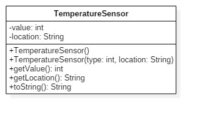
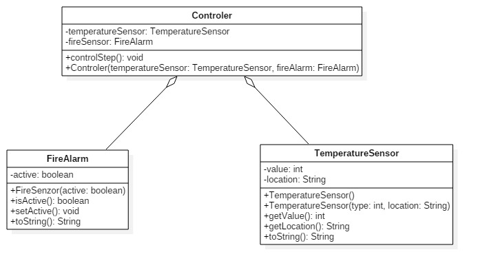
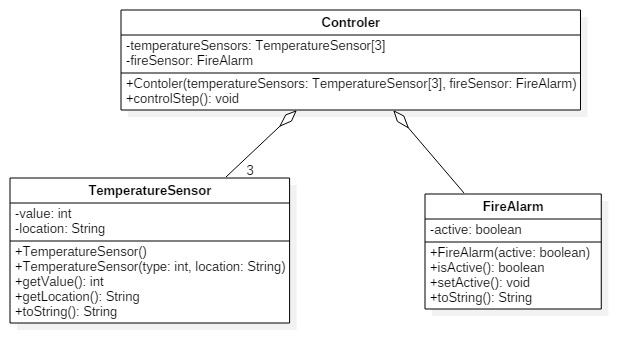
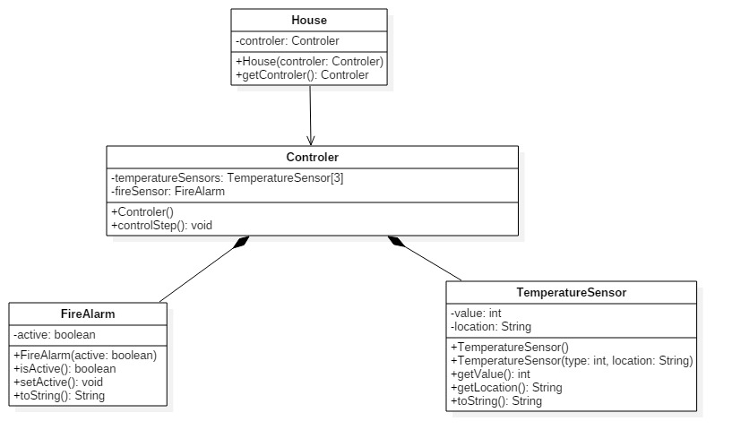
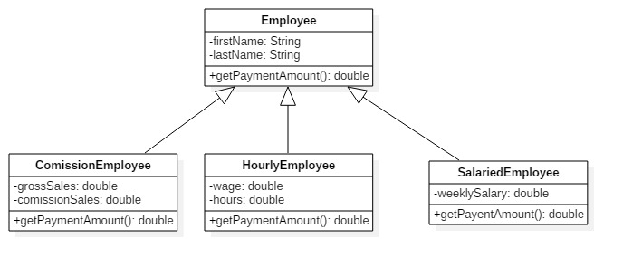

# Implement the following exercises

In this lab you will create small Java applications by using as reference an UML class diagram. Please consider following general notes before start implementing:
- toString() method when required will return a string like *ClassName{attributeName1=attributeValue1,...,attributeNamen=attributeValuen}*.
- Do not reuse (import) the same class in multiple exercises. **Each exercise is standalone and should be resolved in its package.**

## Exercise 0

This exercise demonstrate concepts you will need to apply in this lab. Solution for this diagram can be found in source folder in package *isp.lab4.exercise0*.


**NOTE: This exercise do not require any implementation from student.**

## Exercise 1


Given the UML class diagram above, implement the corresponding Java program.

1. Create Java class based on the diagram above. 
2. Instantiate and test created class in the provided Exercise 1 main method.
3. Create a minimal unit test for testing the behavior of the created class.

```java
package isp.lab4.exercise1;

public class TemperatureSensor {

    //atribute
    
    private int value;
    
    private String location;
    
    //constructori
    
    public TemperatureSensor() {
        value = 0;
        location = "here";
    }
    
    public TemperatureSensor(int type, String location) {
        value = type;
        this.location = location;
    }
    
    //metode
    
    public int getValue() {
        return value;
    }
    
    public String getLocation() {
        return location;
    }
    
    @Override
    public String toString() {
        return String.valueOf(value + " " + location);
    }
    
}

```


## Exercise 2


Given the UML class diagram above, implement the corresponding Java program.

1. Create Java class based on the diagram above. 
2. Instantiate and test created class in the provided Exercise 2 main method.
3. Create a minimal unit test for testing the behavior of the created class.

```java
package isp.lab4.exercise2;

/**
 *
 * @author Razvan
 */
public class FireAlarm {
    
    private boolean active;
    
    public FireAlarm(boolean active) {
        this.active = active;
    }
    
    public boolean isActive() {
        return active;
    }
    
    public void setActive() {
        active = true;
    }
    
    public void setActiveFalse()
    {
        active = false;
    }
    
    @Override
    public String toString() {
        return String.valueOf("Fire Alarm is set on: " + active);
    }
    
    
    
    
}
```

## Exercise 3 


Given the UML class diagram above, implement the corresponding Java program.

1. Create Java classes based on the diagram above. 
    * controlStep() method check temperature and if temperature is > 50 will set fireAlarm sensor *true*.
    * controlStep() method print a message "Fire alarm started" or "Fire alarm not started" based on verification results.
2. Instantiate and test created classes in the provided Exercise 3 main method.
3. Create a minimal unit test for testing the behavior of the created class.

```java
public class Controler {
    
    private TemperatureSensor temperatureSensor;
    
    private FireAlarm fireAlarm;
    
    public Controler(TemperatureSensor temperatureSensor, FireAlarm fireAlarm) {
        this.temperatureSensor = temperatureSensor;
        this.fireAlarm = fireAlarm;
    }
    
    
    public void controlStep() {
        if(temperatureSensor.getValue() > 50) {
            fireAlarm.setActive();
            System.out.println("Fire alarm started!!!");   
        }
        else
           System.out.println("Fire alarm not started.");    
    }
    
    
    
}
```


## Exercise 4


Given the UML class diagram above, implement the corresponding Java program.

1. Create Java classes based on the diagram above. 
    * controlStep() method check temperature and if temperature is > 50 for **all sensors** will set fireAlarm sensor *true*.
    * controlStep() method print a message "Fire alarm started" or "Fire alarm not started" based on verification results.
2. Instantiate and test created classes in the provided Exercise 4 main method.
3. Create a minimal unit test for testing the behavior of the created class.

```java
public class Controler {
    
    private TemperatureSensor[] temperatureSensor = new TemperatureSensor[3];
    
    private FireAlarm fireAlarm;
    
    public Controler(TemperatureSensor[] temperatureSensor, FireAlarm fireAlarm) {
        this.temperatureSensor = temperatureSensor;
        this.fireAlarm = fireAlarm;
    }
    
    
    public void controlStep() {
        
        for(int i=0; i<3; i++)
            if(temperatureSensor[i].getValue() > 50) {
                fireAlarm.setActive();
                System.out.println("Fire alarm started!!!");   
            }
            else
              System.out.println("Fire alarm not started.");    
    }
 
}
```

```java
public class Exercise4 {
    
   public static void main(String[] args) {
       TemperatureSensor[] t1 = new TemperatureSensor[3];
     
       t1[0] = new TemperatureSensor(11, "cbjdwkjc");
       t1[1] = new TemperatureSensor(67, "dewcfr");
       t1[2] = new TemperatureSensor(1, "w2w2wd");
       
       FireAlarm f1 = new FireAlarm(false);
       Controler c1 = new Controler(t1, f1);
       
       c1.controlStep();
       
   } 
}

```

## Exercise 5 


Given the UML class diagram above, implement the corresponding Java program.

1. Create Java classes based on the diagram above. 
    * controlStep() method check temperature and if temperature is > 50 for **at least one sensor** will set fireAlarm sensor *true*.
    * controlStep() method print a message "Fire alarm started" or "Fire alarm not started" based on verification results.
2. Instantiate and test created classes in the provided Exercise 5 main method.
    * call controlStep() method in main by accessing the controller trough *House* object.
3. Create a minimal unit test for testing the behavior of the created class.

```java
public class House {
    private Controler controler;
    
    public House(Controler controler) {
        this.controler = controler;
    }
    
    public Controler getControler() {
        return controler;
    }
}

class Controler {
    
    private TemperatureSensor[] temperatureSensor;
    private FireAlarm fireAlarm;
    
    
    public Controler() {
        
        temperatureSensor = new TemperatureSensor[3];
        temperatureSensor[0] = new TemperatureSensor(11, "cbjdwkjc");
        temperatureSensor[1] = new TemperatureSensor(67, "dewcfr");
        temperatureSensor[2] = new TemperatureSensor(1, "w2w2wd");
        fireAlarm = new FireAlarm(false);
        
    }
    
    
    public void controlStep() {
        
        for(int i=0; i<3; i++)
            if(temperatureSensor[i].getValue() > 50) {
                fireAlarm.setActive();
                System.out.println("Fire alarm started!!!");   
            }
            else
              System.out.println("Fire alarm not started.");    
    }
   
}

```

## Exercise 6 


Given the UML class diagram above, implement the corresponding Java program.

Note: Constructors are not represented in the diagram above, but you will need to add all necessary constructors to be able to initialise all attributes. 

1. Create Java classes based on the diagram above. 
    * method getPaymentAmount() will return 0.0 in base class Employee.
2. Instantiate and test created classes in the provided Exercise 6 main method. 
    1. create 1 object of each derived type and display payment amount.
    2. create a vector of 6 objects of type Employee, add 2 object of each type and calculate total payment.
3. Create a minimal unit test for testing the behavior of the created class.

```java
public class ComissionEmployee extends Employee{
    private double grossSales;
    private double comissionSales;
    
    public ComissionEmployee(double grossSales, double comissionSales, String firstName, String lastName){
        super(firstName, lastName);
        this.comissionSales = comissionSales;
        this.grossSales = grossSales;
    }
    
    @Override
    public double getPaymentAmount() {
        return grossSales+comissionSales;
    }

    @Override
    public String toString() {
        
        return super.toString() + "\nComissionEmployee { " + "grossSales = " + grossSales + ", comissionSales = " + comissionSales + " }";
    }
    
}
```

```java
public class HourlyEmployee extends Employee{
    private double wage;
    private double hours;
    
    public HourlyEmployee(double wage, double hours, String firstName, String lastName) {
        super(firstName, lastName);
        this.hours = hours;
        this.wage = wage;
    }
    
    @Override
    public double getPaymentAmount() {
        return wage*hours;
    }

    @Override
    public String toString() {
        return super.toString() + "\nHourlyEmployee { " + "wage = " + wage + ", hours = " + hours + " }";
    }
    
    
}
```

```java
public class SalariedEmployee extends Employee {
    
    private double weeklySalary;
    
    SalariedEmployee(double weeklySalary, String firstName, String lastName) {
        super(firstName, lastName);
        this.weeklySalary = weeklySalary;
    }
    
    
    @Override
    public double getPaymentAmount() {
        return weeklySalary;
    }

    @Override
    public String toString() {
        return super.toString() + "\nSalariedEmployee { " + "weeklySalary = " + weeklySalary + " }";
    }
    
    
}   
```

```java
public class Employee {
    private String firstName;
    private String lastName;
    
    public Employee(String firstName, String lastName){
        this.firstName = firstName;
        this.lastName = lastName;
    }
    
    public double getPaymentAmount() {
        return 0.0;
    }

    @Override
    public String toString() {
        return "Employee { " + "firstName = " + firstName + ", lastName = " + lastName + " }";
    }
    
}
```

```java
public static void main(String[] args) {
        
        /*
        ComissionEmployee c = new ComissionEmployee(2000, 54.3, "Popescu", "Marian");
        HourlyEmployee h = new HourlyEmployee(60, 32.5, "Popa", "Gheorghe");
        SalariedEmployee s = new SalariedEmployee(1599, "Rusu", "George");
        
        System.out.println(c.getPaymentAmount());
        System.out.println(h.getPaymentAmount());
        System.out.println(s.getPaymentAmount());
        */
        
        
        Employee[] employees = new Employee[6];
        
        employees[0] = new ComissionEmployee(2000, 54.3, "Popescu", "Marian");
        employees[1] = new ComissionEmployee(2000, 99.3, "Popescu", "Maria");
        employees[2] = new HourlyEmployee(60, 32.5, "Popa", "Gheorghe");
        employees[3] = new HourlyEmployee(60, 100.5, "Popa", "Georgiana");
        employees[4] = new SalariedEmployee(1599, "Rusu", "George");
        employees[5] = new SalariedEmployee(3899, "Rusu", "Alexia");
        
        for(int i=0; i<6; i++)
        {
            System.out.println(employees[i].toString());
            System.out.println("Payment amount" + employees[i].getPaymentAmount());
            
        }
   }
```