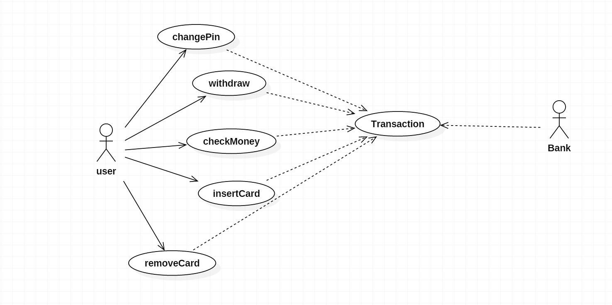
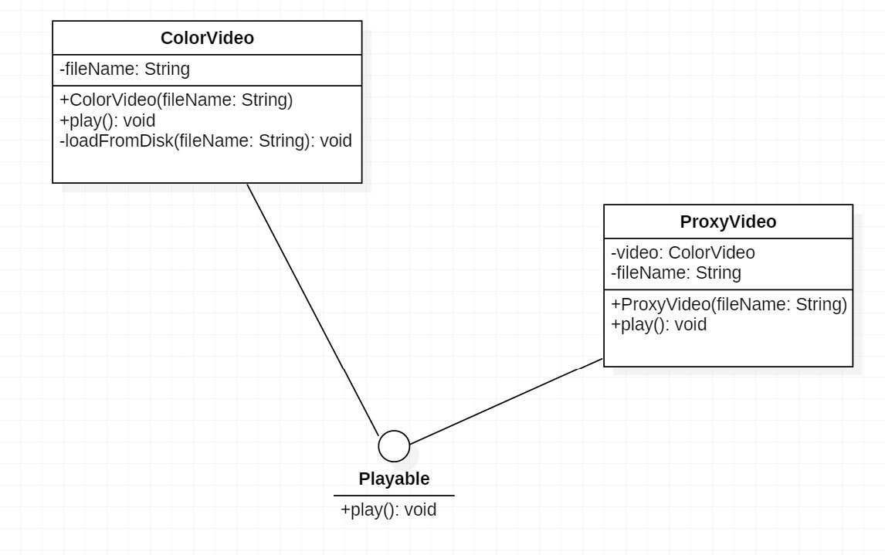
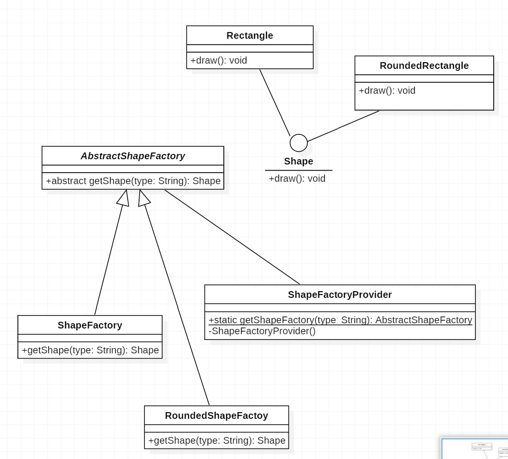

# Implement the following exercises

In this lab you will create small Java applications by using as reference an UML class diagram. Please consider following general notes before start implementing:
- toString() method when required will return a string like *ClassName{attributeName1=attributeValue1,...,attributeNamen=attributeValuen}*.
- Do not reuse (import) the same class in multiple exercises. **Each exercise is standalone and should be resolved in its package.**

## Exercise 1


Given the UML class diagram above, implement the corresponding Java program.

1. Create Java class based on the diagram above. 
    * _insertCard()_ method from ATM will compare received pin with the pin stored in card. If 2 pins match the card will be stored as attribute and will be used for executing transactions.
    * _removeCard()_ method will _invalidate_ a previously inserted card by making the attribute null. 
2. Demonstrate the functionality of application in Exercise1 class main method.
3. Create minimal unit tests for testing the behavior of the programm.

**Note 1: Constructors and setter\getter methods are not represented in the diagram but can\should be implemented."**

**Note 2: You can add any extra methods if required.**

```java
package isp.lab5.exercise1;


import java.util.ArrayList;

//////////////////////////////////////////
abstract class Transaction{
    protected Account account;

    public Transaction(Account account) {
        this.account = account;
    }

    abstract String execute();
}

//////////////////////////////////////////
class Withdraw extends Transaction{
    private int amount;

    public Withdraw(int amount, Account account) {
        super(account);
        this.amount = amount;

    }

    public int getAmount() {
        return amount;
    }

    @Override
    public String execute(){
        if(account.getBalance()>amount){
            account.setBalance(account.getBalance()-amount);
            System.out.println("Transaction executed");
        }
        return "EXECUTED!";
    }
}

//////////////////////////////////////////
class Card{
    private String cardId;
    private String pin;

    public Card(String cardId, String pin) {
        this.cardId = cardId;
        this.pin = pin;
    }

    public String getCardId() {
        return cardId;
    }

    public void setCardId(String cardId) {
        this.cardId = cardId;
    }

    public String getPin() {
        return pin;
    }

    public void setPin(String pin) {
        this.pin = pin;
    }
}

//////////////////////////////////////////
class Account{
    private String owner;
    private int balance;
    private Card card;

    public Account(String owner, int balance, Card card) {
        this.owner = owner;
        this.balance = balance;
        this.card = card;
    }

    public String getOwner() {
        return owner;
    }

    public void setOwner(String owner) {
        this.owner = owner;
    }

    public int getBalance() {
        return balance;
    }

    public void setBalance(int balance) {
        this.balance = balance;
    }

    public Card getCard() {
        return card;
    }

    public void setCard(Card card) {
        this.card = card;
    }
}

//////////////////////////////////////////
class Bank{
    ArrayList<Account> list = new ArrayList<>();

    public void addAccount(Account a){
        list.add(a);
    }

    public void executeTransaction(Transaction t){
        t.execute();
    }

    public Account getAccountByCardId(String id){
        //....
        
        for(int i=0; i<=list.size(); i++)
            if(id.equals(list.get(i).getCard().getCardId()))
                return list.get(i);
                
        //return card
        return null;
    }
}

//////////////////////////////////////////
class ATM{
    private Bank bank;
    private Card card;

    public ATM(Bank bank) {
        this.bank = bank;
    }

    public void insertCard(Card c, String pin){
        if(card==null){
            if(c.getPin().equals(pin)){
                System.out.println("Card accepted.");
                card = c;
            }else{
                System.out.println("Pin is not valid.");
            }
        }else{
            System.out.println("Card already inserted.");
        }
    }

    public void removeCard(){
        card = null;
    }

    public void withdraw(int amount){
        if(card!=null){
            Account acc = bank.getAccountByCardId(card.getCardId());
            Withdraw tw = new Withdraw(amount, acc);
            bank.executeTransaction(tw);

        }else{
            System.out.println("No card present.");
        }
    }
    
    public void checkMoney() {
        Account acc = bank.getAccountByCardId(card.getCardId());
        CheckMoney c = new CheckMoney(acc);
        bank.executeTransaction(c);
    }
    
    public void changePin(String oldPin, String newPin) {
        Account acc = bank.getAccountByCardId(card.getCardId());
        ChangePin p = new ChangePin(oldPin, newPin, acc);
        if(oldPin.equals(this.card.getPin()))
            bank.executeTransaction(p);
        else
            System.out.println("Invalid PIN!");
  
    } 
    
}

class CheckMoney extends Transaction{
    
    public CheckMoney(Account account) {
        super(account);
    }
    
    @Override
    public String execute() {
        System.out.println(this.account.getBalance());
        return "EXECUTED!";
    }
}

class ChangePin extends Transaction {
    private String oldPin;
    private String newPin;
    
    public ChangePin(String oldPin, String newPin, Account account) {
        super(account);
        this.oldPin = oldPin;
        this.newPin = newPin;
    }        
    
    @Override
    public String execute(){
        this.account.getCard().setPin(newPin);
        
        return "EXECUTED!";
    }
}
//////////////////////////////////////////

public class Exercise1 {

    public static void main(String[] args) {
        Card c1 = new Card("12345","0000");
        System.out.println(c1.getCardId());
        
        Account a1 = new Account("Mihai",1000, c1);

        System.out.println(a1.getCard().getPin());
        System.out.println(a1.getOwner());
        
        Bank bank = new Bank();
        bank.addAccount(a1);

        
        System.out.println(bank.list.get(0).getOwner());
        
        ATM atm = new ATM(bank);

        
        atm.insertCard(c1,"0000");
        atm.checkMoney();
        atm.withdraw(900);
        atm.checkMoney();
        atm.insertCard(c1,"1000");
        System.out.println(bank.getAccountByCardId("12345").getOwner());

    }
}
```


## Exercise 2

Create an UML Use-Case diagram describing an ATM system. Save jpg use case diagram in /docs subfolder and display it in this readme file bellow.

**>>>>insert use case diagram here<<<<**


```java

```

## Exercise 3


```java
interface Playable {
    void play();
}

class ColorVideo implements Playable {

    private String fileName;

    public ColorVideo(String fileName){
        this.fileName = fileName;
        loadFromDisk(fileName);
    }

    @Override
    public void play() {
        System.out.println("Play " + fileName);
    }

    private void loadFromDisk(String fileName){
        System.out.println("Loading video..." + fileName);
    }
}

class ProxyVideo implements Playable {

    private ColorVideo video;
    private String fileName;

    public ProxyVideo(String fileName){
        this.fileName = fileName;
    }

    @Override
    public void play() {
        if(video == null){
            video = new ColorVideo(fileName);
        }
        video.play();
    }
}
```

For the application above:
* create UML class diagram and display it bellow.
* add a new class _BlackAndWhiteVideo_ which will display message "Play black and white video {name of the video}".
* add necessary changes in ProxyVideo class so that depending on a constructor argument given in this class the proxy to call either black and white or color playable video.

**>>>>insert class diagram here<<<<**



## Exercise 4

```java
public interface Shape {
    /**
     * Draw a specific shape
     */
    void draw();
}

public class Rectangle implements Shape {
    @Override
    public void draw() {
        System.out.println("A rectangle is drawn");
    }
}

public class RoundedRectangle implements Shape {
    @Override
    public void draw() {
        System.out.println("A rounded rectangle is drawn");
    }
}

public abstract class AbstractShapeFactory {
    /**
     * Get specific shape by type
     * @param type - one of the values ("rectangle", "roundedRectangle", "square", "roundedSquare")
     * @return instance of shape by desired type
     */
    abstract Shape getShape(String type);
}

public class ShapeFactory extends AbstractShapeFactory {
    @Override
    Shape getShape(String type) {
        if ("rectangle".equals(type)) {
            return new Rectangle();
        }

        return null;
    }
}

public class RoundedShapeFactory extends AbstractShapeFactory {
    @Override
    Shape getShape(String type) {
        if ("roundedRectangle".equals(type)) {
            return new RoundedRectangle();
        }

        return null;
    }
}

public class ShapeFactoryProvider {
    private ShapeFactoryProvider() {
    }

    /**
     * Get an instance of {@link AbstractShapeFactory} based on <param>type</param>
     * @param type - one of the values "normal" / "rounded"
     * @return instance of type {@link AbstractShapeFactory}
     */
    public static AbstractShapeFactory getShapeFactory(String type) {
        if ("normal".equals(type)) {
            return new ShapeFactory();
        }

        if ("rounded".equals(type)) {
            return new RoundedShapeFactory();
        }

        return null;
    }
}

public class Main {
    public static void main(String[] args) {
        AbstractShapeFactory roundedShapeFactory = ShapeFactoryProvider.getShapeFactory("rounded");
        AbstractShapeFactory normalShapeFactory = ShapeFactoryProvider.getShapeFactory("normal");

        // create instances
        Shape rectangle = roundedShapeFactory.getShape("roundedRectangle");
        Shape shape = normalShapeFactory.getShape("rectangle");

        rectangle.draw();
        shape.draw();
    }
}

```

For the application above:
* create UML class diagram and display it bellow.
* add new two classes(_Square_ and _RoundedSquare_) which will have their own implementation of draw method.
* adapt the current implementation in order to be able to create instances of these classes based on their type. Test the new functionality using Main class.

**>>>>insert class diagram here<<<<**
