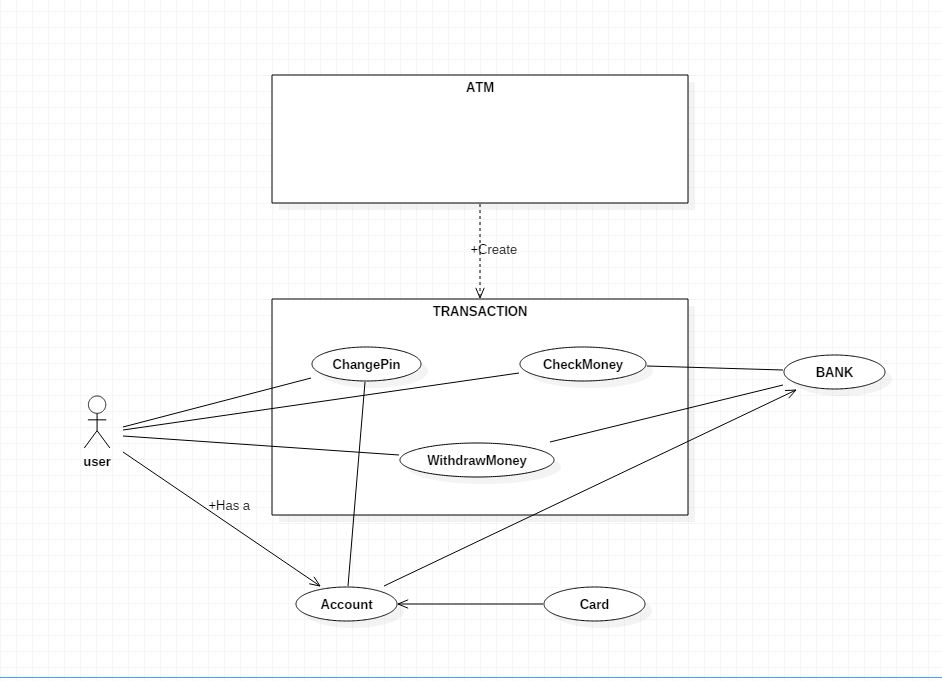
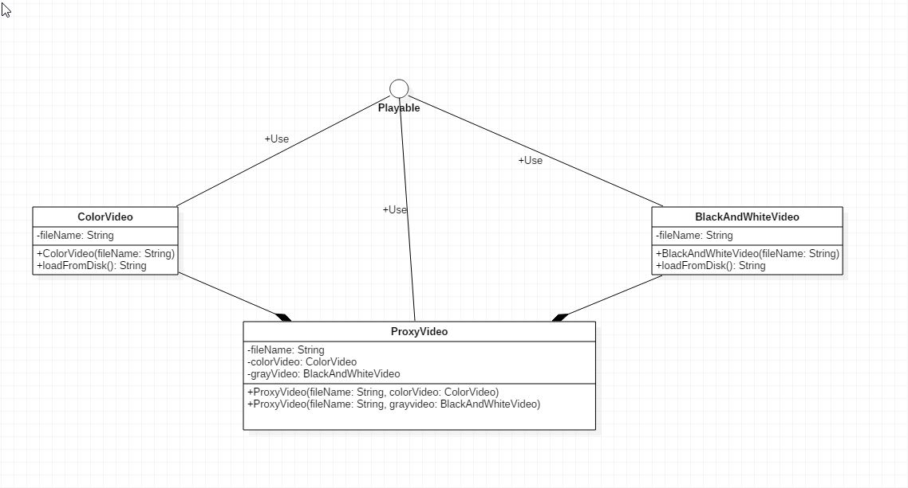
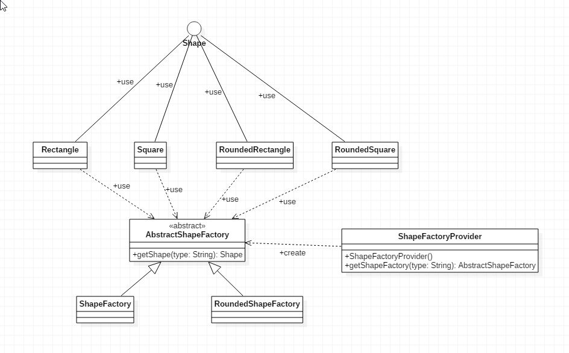

# Implement the following exercises

In this lab you will create small Java applications by using as reference an UML class diagram. Please consider following general notes before start implementing:
- toString() method when required will return a string like *ClassName{attributeName1=attributeValue1,...,attributeNamen=attributeValuen}*.
- Do not reuse (import) the same class in multiple exercises. **Each exercise is standalone and should be resolved in its package.**

## Exercise 1


Given the UML class diagram above, implement the corresponding Java program.

1. Create Java class based on the diagram above. 
    * _insertCard()_ method from ATM will compare received pin with the pin stored in card. If 2 pins match the card will be stored as attribute and will be used for executing transactions.
    * _removeCard()_ method will _invalidate_ a previously inserted card by making the attribute null. 
2. Demonstrate the functionality of application in Exercise1 class main method.
3. Create minimal unit tests for testing the behavior of the programm.

**Note 1: Constructors and setter\getter methods are not represented in the diagram but can\should be implemented."**

**Note 2: You can add any extra methods if required.**


## Exercise 2

Create an UML Use-Case diagram describing an ATM system. Save jpg use case diagram in /docs subfolder and display it in this readme file bellow.



## Exercise 3

```java
package isp.lab5.exercise3;

interface Playable {
    void play();
}

class ColorVideo implements Playable {

    private String fileName;

    public ColorVideo(String fileName){
        this.fileName = fileName;
        loadFromDisk(fileName);
    }

    @Override
    public void play() {
        System.out.println("Play " + fileName);
    }

    private void loadFromDisk(String fileName){
        System.out.println("Loading video... " + fileName);
    }
}

class BlackAndWhiteVideo implements Playable {
    private String fileName;
    
     public BlackAndWhiteVideo(String fileName){
        this.fileName = fileName;
        loadFromDisk(fileName);
    }

    @Override
    public void play() {
        System.out.println("Play black and white video " + fileName);
    }

    private void loadFromDisk(String fileName){
        System.out.println("Loading black and white video... " + fileName);
    }
}

class ProxyVideo implements Playable {

    private ColorVideo colorVideo;
    private String fileName;
    private BlackAndWhiteVideo grayVideo;
    public ProxyVideo(String fileName,BlackAndWhiteVideo grayVideo){
        this.fileName = fileName;
        this.grayVideo=grayVideo;
    }
    public ProxyVideo(String fileName,ColorVideo colorVideo){
        this.fileName = fileName;
        this.colorVideo=colorVideo;
    }

    @Override
    public void play() {
        if(colorVideo != null){
            colorVideo.play();
        }
        if(grayVideo != null)
        {
            grayVideo.play();
        }
    }
}

public class Exercise3 {
    public static void main(String[] args) {
    ColorVideo EldenRings = new ColorVideo("EldenRings");
    EldenRings.play();
    BlackAndWhiteVideo Tetris = new BlackAndWhiteVideo("Tetris");
    Tetris.play();
    ProxyVideo Game1 = new ProxyVideo("EldenRings",EldenRings);
    Game1.play();
    ProxyVideo Game2 = new ProxyVideo("Tetris",Tetris);
    Game2.play();
    }
}

```

For the application above:
* create UML class diagram and display it bellow.
* add a new class _BlackAndWhiteVideo_ which will display message "Play black and white video {name of the video}".
* add necessary changes in ProxyVideo class so that depending on a constructor argument given in this class the proxy to call either black and white or color playable video.



## Exercise 4

```java
package isp.lab5.exercise4;

interface Shape {
    /**
     * Draw a specific shape
     */
    void draw();
}

class Rectangle implements Shape {
    @Override
    public void draw() {
        System.out.println("A rectangle is drawn");
    }
}

class Square implements Shape {
    @Override
    public void draw() {
        System.out.println("A square is drawn");
    }
}

class RoundedRectangle implements Shape {
    @Override
    public void draw() {
        System.out.println("A rounded rectangle is drawn");
    }
}

class RoundedSquare implements Shape {
    @Override
    public void draw() {
        System.out.println("A rounded square is drawn");
    }
}

abstract class AbstractShapeFactory {
    /**
     * Get specific shape by type
     * @param type - one of the values ("rectangle", "roundedRectangle", "square", "roundedSquare")
     * @return instance of shape by desired type
     */
    abstract Shape getShape(String type);
}

class ShapeFactory extends AbstractShapeFactory {
    @Override
    Shape getShape(String type) {
        if ("rectangle".equals(type)) {
            return new Rectangle();
        }
        if ("square".equals(type)) {
            return new Square();
        }
        return null;
    }
}

class RoundedShapeFactory extends AbstractShapeFactory {
    @Override
    Shape getShape(String type) {
        if ("roundedRectangle".equals(type)) {
            return new RoundedRectangle();
        }
        if ("roundedSquare".equals(type)) {
            return new RoundedSquare();
        }
        return null;
    }
}

class ShapeFactoryProvider {
    private ShapeFactoryProvider() {
    }

    /**
     * Get an instance of {@link AbstractShapeFactory} based on <param>type</param>
     * @param type - one of the values "normal" / "rounded"
     * @return instance of type {@link AbstractShapeFactory}
     */
static AbstractShapeFactory getShapeFactory(String type) {
        if ("normal".equals(type)) {
            return new ShapeFactory();
        }

        if ("rounded".equals(type)) {
            return new RoundedShapeFactory();
        }

        return null;
    }
}

public class Exercise4 {
    public static void main(String[] args) {
        AbstractShapeFactory roundedShapeFactory = ShapeFactoryProvider.getShapeFactory("rounded");
        AbstractShapeFactory normalShapeFactory = ShapeFactoryProvider.getShapeFactory("normal");

        // create instances
        Shape rectangle = roundedShapeFactory.getShape("roundedRectangle");
        Shape shape = normalShapeFactory.getShape("rectangle");
        
        Shape square = roundedShapeFactory.getShape("roundedSquare");
        Shape shape2 = normalShapeFactory.getShape("square");

        rectangle.draw();
        shape.draw();
        
        square.draw();
        shape2.draw();
    }
}

```

For the application above:
* create UML class diagram and display it bellow.
* add new two classes(_Square_ and _RoundedSquare_) which will have their own implementation of draw method.
* adapt the current implementation in order to be able to create instances of these classes based on their type. Test the new functionality using Main class.


