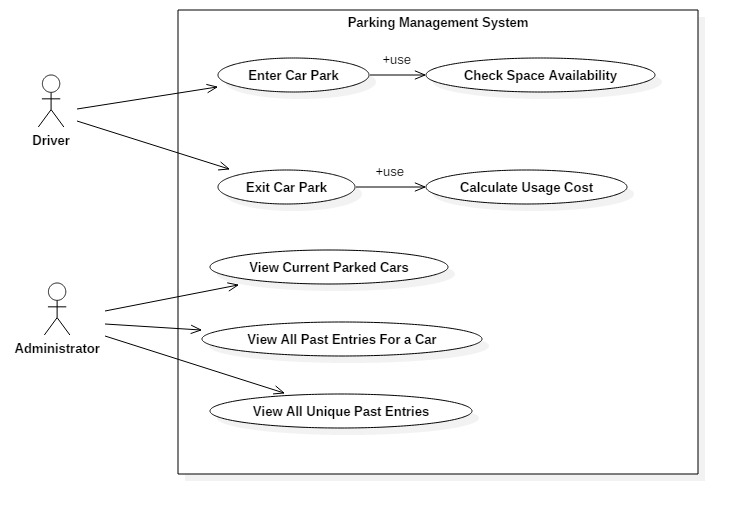
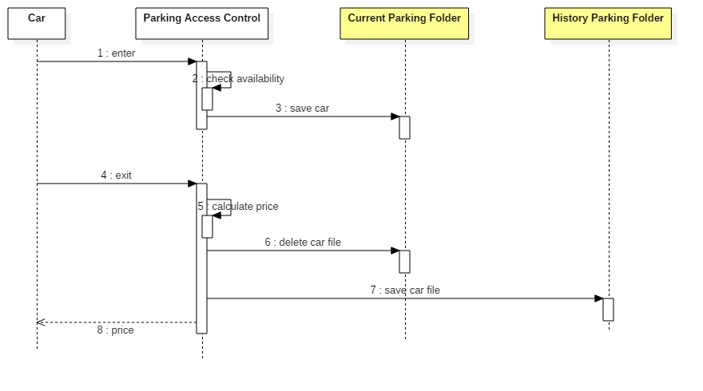

# Lab 8 - Car Parking Access Controll System


## Exercise 1 

Implement a car access parking system based on the requirements bellow. 

Note 1 - Source folder contains some classes which can be used as starting point or refference for implementing the application. 

Note 2 - There is no need to implement access control levels (user and admin) as represented in the use case diagram bellow. 

Note 3 - For storing cars on disk check utility classes given as example in 'files' package.

### Functional requirements



**Enter Car Park**
- car is identified by plate number
- if there are free parking spaces car is allowed to enter if not the car access is denied
- access is denied if a car with the same plate umber is already parked

**Check Space Available**
- parking has a limited number of places available (configurable through the app)
- if number of spaces available is 0 car is denied access

**Exit Car Park**
- when leaving total stay cost is calculated 
- after leaving an access log for that car and period is stored for reporting purpose

**Calculare Usage Cost**
- cost of parking is calculated in increments of 1 SECOND to make it more easy to tests the system 
- 1 SECOND costs 1 RON

**View Current Parked Cars**
- display all cars currently parked. Display : plate number, entry time, current cost
- display available free spaces 

**View All Past Entries for a Car**
- display all past entries for a car. Display: plate number, entry time, total stay (in seconds), total cost;
- display total cost for all stays

**View All Unique Past Entries**
- display all unique cars eneterd in parking lot in the past. Display: plat number and number of entries for each car 

### Non-functional requirements (technical constraints)

1. Car access details will be stored in a persistant storage on disk as files and the state is not lost when the application is restarted. 
2. Car access details can be stored using one of the 2 Java mechanisms: JSON obejects, Serialization. 
3. Minimal unit-tests should be provided to demonstrate the correct behaviour of the system.

```java
import java.io.Serializable;
import java.util.Objects;

/**
 *
 * @author Razvan
 */
public class Car implements Serializable {
    private String plateNumber;
    private long entryTime;

    public Car(String plateNumber, long entryTime) {
        this.plateNumber = plateNumber;
        this.entryTime = entryTime;
    }

    public String getPlateNumber() {
        return plateNumber;
    }

    public long getEntryTime() {
        return entryTime;
    }

    @Override
    public int hashCode() {
        int hash = 3;
        hash = 37 * hash + Objects.hashCode(this.plateNumber);
        return hash;
    }

    @Override
    public boolean equals(Object obj) {
        if (this == obj) {
            return true;
        }
        if (obj == null) {
            return false;
        }
        if (getClass() != obj.getClass()) {
            return false;
        }
        final Car other = (Car) obj;
        if (!Objects.equals(this.plateNumber, other.plateNumber)) {
            return false;
        }
        return true;
    }

    @Override
    public String toString() {
        return "Car{" + "plateNumber=" + plateNumber + ", entryTime=" + entryTime + '}';
    }
    
    
}
```

```java
import java.util.ArrayList;

/**
 *
 * @author Razvan
 */
public class ParkingAccessControl {

    public static final int MAX_CAPACITY = 5;
    
    private ArrayList<Car>  parkedCars = new ArrayList<>();
   
    private ArrayList<Car>  previousCars = new ArrayList<>(); 
    

    public void carEntry(Car car){
        //1. sa verific capacitatea 
        //2. daca capacitatea este depasita -> return 
        //3. verific daca nu cumva masina este deja in parcare, si daca este -> return 
        //4. daca masina nu este in parcare salvez obiectul de tip car in parkedCars 
        
        if(checkSpaceAvailability()) {
            return;
        }
        
        for(Car parkedCar : parkedCars) {
            if(parkedCar.equals(car))
                return;
        }
        
        
        parkedCars.add(car);
        /*System.out.println(car);
        for(Car parkedCar : parkedCars) {
            System.out.println(parkedCar);
        }*/
        System.out.println("Car "+car+" is entering car park!");
    }
    
    public boolean checkSpaceAvailability(){
            return parkedCars.size() >= MAX_CAPACITY;
    }
    
    public int carExit(String plateNumber){
        //1. cautam dupa plate number un Car in parkedCars
        //2. daca nu am gasit plateNumber -> return 
        //3. daca am gasit masina, 
            //calculez timpul de asteptare in parcare, -> System.currentTimeMiliseconds()
            //calculez pretul, 
            //sterg masina din parkedCars si o adaug in previousCars
            //returnez pretul
        Car car = null;
        for(Car parkedCar : parkedCars) {
            if(parkedCar.getPlateNumber().equals(plateNumber))
                car = parkedCar;
        }
        if(car == null)
            return 0;
        long time = System.currentTimeMillis() - car.getEntryTime();
        
        System.out.println("Car with plate number "+plateNumber+" is exiting");
        
        previousCars.add(car);
        parkedCars.remove(car);
        
        return usageCost(time);
    }
    
    public int usageCost(long time){
        return 1*(int)time/1000;
    }
    
    public void viewCurrentCars(){
        System.out.println("Display all parked cars: ");
        if(parkedCars.isEmpty()) {
            System.out.println("No cars. ");
        } else {
            for(Car parkedCar : parkedCars) {
                System.out.println(parkedCar);
            }
        }
        
    }
    
    public void viewPastEntriesForCar(String plateNumber){
        System.out.println("Display all past entries for a car.");
        for(Car parkedCar : previousCars) {
            if(parkedCar.getPlateNumber().equals(plateNumber)) {
                System.out.println(parkedCar);
            }     
        }
    }
    
    public void viewPastUniqueEntries(){
        System.out.println("Display all unique entries.");
        
        int nb;
        
        for(int i=0; i<previousCars.size(); i++) {
            nb = 0;
            Car car = previousCars.get(i);
            for(int j=i+1; j<previousCars.size(); j++) {
                if(car.equals(previousCars.get(j)))
                {
                    nb++;
                    previousCars.remove(previousCars.get(j));
                }
            }
            System.out.println(previousCars.get(i).getPlateNumber() + " entered times: " + nb);
        }
    }
    
}
```

```java
import java.io.*;
import java.nio.charset.Charset;
import java.nio.charset.StandardCharsets;
import java.nio.file.Files;
import java.nio.file.Path;
import java.nio.file.Paths;
import java.util.ArrayList;
import java.util.Arrays;
import java.util.List;

/**
 *
 * @author Razvan
 */
public class FileReadUtil {
    
    public static List<String> readAllFileLines(String file) throws IOException{
        Path path = Paths.get(file);       
        byte[] bytes = Files.readAllBytes(path);
        return Files.readAllLines(path, StandardCharsets.UTF_8);
    }
    
    /**
     * For large text file we can use a buffered reader.
     * 
     * @param fileName
     * @param cs
     * @return
     * @throws IOException 
     */
    public static List<String> readUsingBufferedReader(String fileName, Charset cs) throws IOException {
        Path path = Paths.get(fileName);
        List<String> lines = new ArrayList<>();
        try(BufferedReader br = Files.newBufferedReader(path, cs)){     
            String line;
           
            while((line = br.readLine()) != null){
                //process the line
                lines.add(line);
            }
        }
        return lines;
    }
    
}
```

```java
import java.io.File;
import java.util.Arrays;
import java.util.List;

/**
 *
 * @author Razvan
 */
public class FilesAndFoldersUtil {
    
     public static void createFolder(String folder){
      File d = new File(folder);
      d.mkdirs();
    }
     
     public static void deleteFile(String file){
         File f = new File(file);
         f.delete();
     }
    
    public static List<String> getFilesInFolder(String folder){
      File file = null;
      String[] paths;
      file = new File(folder);
      return Arrays.asList(file.list());
    }
}
```

```java
import isp.lab8.carparkaccess.*;
import isp.lab8.carparkaccess.file.FileReadUtil;
import isp.lab8.carparkaccess.file.FilesAndFoldersUtil;
import isp.lab8.carparkaccess.file.SerializableUtil;
import java.io.IOException;
import java.util.List;
import java.util.logging.Level;
import java.util.logging.Logger;

/**
 * Persistena pe disc utilizand mecanismul de seralizare. Pentru a funnctiona
 * clasa Car trebuie sa implementeze interfata Serializable. 
 * @author Razvan
 */
public class ParkingAccessFileControl{

    private String working_folder="C:\\NetBeans_prjs\\isp-labs-2022-ghiliman-antonia-ioana-30121\\isp-lab-8-2021-master";
    private  int UNIT_PRICE = 1;
    
    public void carEntry(Car car) {
        try {
            SerializableUtil.writeVehicle(car, working_folder+"\\"+"car_"+car.getPlateNumber()+".dat");
        } catch (IOException ex) {
            Logger.getLogger(ParkingAccessFileControl.class.getName()).log(Level.SEVERE, null, ex);
        }
    }

    public int carExit(String plateNumber) {
        try{
          //get all files in working folder
          List<String> files = FilesAndFoldersUtil.getFilesInFolder(working_folder);
          
          for(String f: files){
              //get vehicle and look for plate number
              System.out.println("Search "+f);
              Car v = (Car)SerializableUtil.readVehicle(working_folder+"\\"+f);
              if(v.getPlateNumber().equals(plateNumber)){
                  //if plate number found calculate price, remove vehicle and return price
                  System.out.println("Vehicle is exiting car park.");
                  long stay = (System.currentTimeMillis() - v.getEntryTime())/1000;
                  FilesAndFoldersUtil.deleteFile(working_folder+"\\car_"+plateNumber+".dat");
                  return (int)(stay * UNIT_PRICE);
              }             
          }
          
        }catch(Exception e){
            e.printStackTrace();
        }
        return -1;
    }

    public void viewCurrentCars() {
       
        //this.viewCurrentCars();
        //throw new UnsupportedOperationException("Not supported yet."); //To change body of generated methods, choose Tools | Templates.
    }

    public void viewPastEntriesForCar(String plateNumber) {
        //this.viewPastEntriesForCar(plateNumber);
        //throw new UnsupportedOperationException("Not supported yet."); //To change body of generated methods, choose Tools | Templates.
    }

    public void viewPastUniqueEntries(String plateNumber) {
        //this.viewPastUniqueEntries(plateNumber);
        //throw new UnsupportedOperationException("Not supported yet."); //To change body of generated methods, choose Tools | Templates.
    }

  
    
}
```

```java
import java.io.File;
import java.io.FileInputStream;
import java.io.FileOutputStream;
import java.io.IOException;
import java.io.ObjectInputStream;
import java.io.ObjectOutputStream;
import java.util.List;

/**
 *
 * @author Razvan
 */
public class SerializableUtil {
   public static void writeVehicle(Object v, String destinationFile) throws IOException{
       try(ObjectOutputStream os = new ObjectOutputStream(new FileOutputStream(destinationFile))){
           os.writeObject(v);
           os.flush();
        }
   } 
   
   public static Object readVehicle(String sourceFile) throws IOException, ClassNotFoundException{
       try(ObjectInputStream in = new ObjectInputStream(new FileInputStream(sourceFile))){
           return in.readObject();
       }
   }
  
}

```

```java
import isp.lab8.carparkaccess.file.ParkingAccessFileControl;
import java.util.concurrent.TimeUnit;

public class CarParkingAccessApp {
    public static void main(String[] args) throws InterruptedException {
        System.out.println("It works!");
        
        ParkingAccessControl pac = new ParkingAccessControl();
        
        Car c1 = new Car("CJ-01-AAA", System.currentTimeMillis());
        Car c7 = new Car("CJ-03-AAA", System.currentTimeMillis());
        
        pac.carEntry(c1);
        pac.carEntry(c7);
        
        TimeUnit.SECONDS.sleep(3);
        
        int price1 = pac.carExit("CJ-01-AAA");
        pac.viewCurrentCars();
        System.out.println("Price for parking is = "+price1);
        
        ////////////////////////////////
        
        /*ParkingAccessFileControl fpac = new ParkingAccessFileControl();
        Car c2 = new Car("CJ-02-AAA", System.currentTimeMillis());
        Car c3 = new Car("CJ-02-BBB", System.currentTimeMillis());
        Car c4 = new Car("CJ-02-CCC", System.currentTimeMillis());*/
        
        //fpac.carEntry(c2);
        //fpac.carEntry(c3);
        //fpac.carEntry(c4);
        
        //price = fpac.carExit("CJ-02-CCC");
        
        //fpac.viewCurrentCars();
        
        //System.out.println("Price to be payed = "+price);
    }
}
```




