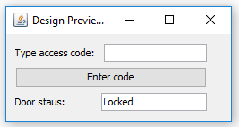

# Lab 9

## Exercise 1 

In listing bellow is presented a basic implementation of Observer design pattern. 

```java
import java.util.ArrayList;
import java.util.List;
 
class Observable {
 
   private List<Observer> observers = new ArrayList<Observer>();
 
   public void changeState(Object event) {
      notifyAllObservers(event);
   }
 
   public void register(Observer observer) {
      observers.add(observer);		
   }
 
   private void notifyAllObservers(Object event) {
      for (Observer observer : observers) {
         observer.update(event);
      }
   } 	
}
 
interface Observer {
   public abstract void update(Object event);
}
 
//usage example
 
class Alarm extends Observable {
    void startAlarm() {
        System.out.println("Alarm has been started!");
        this.changeState("START");
    }
 
    void stopAlarm() {
        System.out.print("Alarm has been stopped!");
        this.changeState("STOP");
    }
}
 
class AlarmMonitor implements Observer {
 
    @Override
    public void update(Object event) {
        System.out.println("Alarm status has changed!");
        System.out.println("Received event: Event class:"+event.getClass()+":"+event.toString());
 
    }
 
}
 
 
public class Client {
    public static void main(String[] args) throws InterruptedException{
        Alarm fireAlarm = new Alarm();
        AlarmMonitor monitor = new AlarmMonitor();
        fireAlarm.register(monitor);
 
        fireAlarm.startAlarm();
        Thread.sleep(500);
        fireAlarm.stopAlarm();
 
    }
}
```

1. Add  in exercise1 package classes from listing above and execute the code. Notice the mechanism used to send notifications to AlarmMonitor each time Alarm object change it's state. 
2. Create a class AlarmController and register an object of this type as observer for the Alarm object. Each time controller is notified will print messaje "Sending SMS message to owner."

```java
class AlarmController implements Observer {

    @Override
    public void update(Object event) {
        System.out.println("Sending SMS message to owner.");
    }
    
}
```

## Exercise 2
A system is composed of 1 controller and 3 sensor types (TEMPERATURE, HUMIDITY, PRESSURE). Each sensor has a `void readSensor()` method which, when executed will randomly generate a value. 
Controller is registered as observer for the 3 sensors. Each time a sensor change it's value controller is notified and will print sensor value and sensor type.  

1. Implement a Java program based on the above description.
2. Test the functionality in `main()` method. From main readValue() method will be called for each sensor to test Observer pattern is working.

**Note** you should use Observer design pattern  

```java
import java.util.ArrayList;
import java.util.List;
import java.util.Random;
 
class Observable {
 
   private List<Observer> observers = new ArrayList<>();
 
   public void changeState(Object event, double value) {
      notifyAllObservers(event, value);
   }
 
   public void register(Observer observer) {
      observers.add(observer);		
   }
 
   private void notifyAllObservers(Object event, double value) {
      for (Observer observer : observers) {
         observer.update(event, value);
      }
   } 	
}
 
interface Observer {
   public abstract void update(Object event, double value);
}
 
//usage example

class Sensors extends Observable {
    
    private double TEMPERATURE;
    private double HUMIDITY;
    private double PRESSURE;
    
    void readSensor(String sensor) {
        Random rand = new Random();
        switch (sensor) {
            case "TEMPERATURE":
                TEMPERATURE = rand.nextDouble();
                this.changeState("TEMPERATURE", TEMPERATURE);
                break;
            case "HUMIDITY":
                HUMIDITY = rand.nextDouble();
                this.changeState("HUMIDITY", HUMIDITY);
                break;
            case "PRESSURE":
                PRESSURE = rand.nextDouble();
                this.changeState("PRESSURE", PRESSURE);
                break;
            default:
                break;
        }
        
    }
}


class Controller implements Observer{
     @Override
    public void update(Object event, double value) {
       System.out.println(event + " = " + value);
    }
}

public class SensorsMain {
    public static void main(String[] args) throws InterruptedException{
        Sensors sensors = new Sensors();
        
        Controller controller = new  Controller();
        
        sensors.register(controller);
  
        sensors.readSensor("TEMPERATURE");
        sensors.readSensor("HUMIDITY");
        sensors.readSensor("PRESSURE");
        sensors.readSensor("TEMPERATURE");
 
    }
            
}
```

## Exercise 3

Add a user interface similar with the one in diagram bellow for `Safe Home Access` application from Lab 8.

```java
import javax.swing.*;
import java.awt.*;
import java.awt.event.ActionEvent;
import java.awt.event.ActionListener;
import static javax.swing.WindowConstants.EXIT_ON_CLOSE;
import isp.lab7.safehome.DoorLockController;
import java.util.logging.Level;
import java.util.logging.Logger;

class SafeHomeAccess_GUI implements ActionListener{
    
    static DoorLockController doorContrl;
            
    JFrame frame;
    JLabel label1;
    JLabel label2;
    JTextField text1;
    JTextField text2;
    JButton button;
            
    SafeHomeAccess_GUI() {
        doorContrl  = new DoorLockController();
        frame = new JFrame();
        
        frame.setSize(300, 150); //set frames size in pixels
        frame.setDefaultCloseOperation(EXIT_ON_CLOSE);
        
        label1 = new JLabel("Type access code: ");
        label1.setBounds(10, 10, 150, 20);
        
        text1 = new JTextField();
        text1.setBounds(150, 10, 100, 20);
        
        button = new JButton("Enter code");
        button.setBounds(10, 40, 100, 20);
        
        label2 = new JLabel("Door status: ");
        label2.setBounds(10, 70, 100, 20);
        
        text2 = new JTextField();
        text2.setBounds(100, 70, 100, 20);
        
        Container pane = frame.getContentPane(); // Not mandatory since Java 5.0
        //pane.setLayout(new FlowLayout(FlowLayout.CENTER));
        pane.setLayout(null);
        
        pane.add(label1);
        pane.add(label2);
        pane.add(text1);
        pane.add(text2);
        pane.add(button); // ... you can simply do: 'add(but1)'
        
        
        button.addActionListener(this);
        
        frame.setVisible(true);
    }
    

    @Override
    public void actionPerformed(ActionEvent e) {
        System.out.println("I've been clicked!");

        if(e.getSource() == button) {
            String status = "CLOSE";
            String pin = text1.getText();
            
            
            try {
                 status = String.valueOf(doorContrl.enterPin(pin));
            } catch (Exception ex) {
                Logger.getLogger(SafeHomeAccess_GUI.class.getName()).log(Level.SEVERE, null, ex);
            }
            finally {
                text2.setText(status);
            }
        }
            
    }
        
   
    public static void main(String[] args) {
        SafeHomeAccess_GUI gui = new SafeHomeAccess_GUI();
        
        try {
            doorContrl .addTenant("123", "name1");
        } catch (Exception ex) {
            Logger.getLogger(SafeHomeAccess_GUI.class.getName()).log(Level.SEVERE, null, ex);
        }
        
        
        
        System.out.println("main thread coninues");
    }
}
```



## Exercise 4 (Optional)

Study MVC design pattern and how this can be implemented in Java. Here are some links presenting how MVC pattern can be implemented:
- https://medium.com/@ssaurel/learn-to-make-a-mvc-application-with-swing-and-java-8-3cd24cf7cb10 
- https://examples.javacodegeeks.com/core-java/java-swing-mvc-example/ 

Use MVC pattern to add a user interface to program in exercise 2 where will be a button and a text field for each sensor type. When button is pressed value of the sensor is displayed in the text field.

```java
public class Controller { 
    
    private Model model;
    private View view;
    
    public Controller(Model m, View v) {
        model = m;
        view = v;
        initView();
    }
    
    public void initView() {
        
        view.getTextSensor1().setText(String.valueOf(model.getTEMPERATURE()));
        view.getTextSensor2().setText(String.valueOf(model.getHUMIDITY()));
        view.getTextSensor3().setText(String.valueOf(model.getPRESSURE()));
        
        
    }
    public void initController() {
        
        view.getButtonSensor1().addActionListener(e -> sensor1());
        view.getButtonSensor2().addActionListener(e -> sensor2());
        view.getButtonSensor3().addActionListener(e -> sensor3());
    }
    
    private void sensor1() {
        model.setTEMPERATURE(view.returnRandomValue());
        //view.getTextSensor1().setText(String.valueOf(model.getTEMPERATURE()));
        initView();
    }
    
    private void sensor2() {
        model.setHUMIDITY(view.returnRandomValue());
        //view.getTextSensor2().setText(String.valueOf(model.getHUMIDITY()));
        initView();
    }
    
    private void sensor3() {
        model.setPRESSURE(view.returnRandomValue());
        //view.getTextSensor3().setText(String.valueOf(model.getPRESSURE()));
        initView();
    }
}
```

```java
public class Model {
    private double TEMPERATURE;
    private double HUMIDITY;
    private double PRESSURE;

    public double getTEMPERATURE() {
        return TEMPERATURE;
    }

    public void setTEMPERATURE(double TEMPERATURE) {
        this.TEMPERATURE = TEMPERATURE;
    }

    public double getHUMIDITY() {
        return HUMIDITY;
    }

    public void setHUMIDITY(double HUMIDITY) {
        this.HUMIDITY = HUMIDITY;
    }

    public double getPRESSURE() {
        return PRESSURE;
    }

    public void setPRESSURE(double PRESSURE) {
        this.PRESSURE = PRESSURE;
    }
    
    
    
}
```

```java
public class View{     
    private JFrame frame;
    private JTextField textSensor1;
    private JTextField textSensor2;
    private JTextField textSensor3;
    private JButton buttonSensor1;
    private JButton buttonSensor2;
    private JButton buttonSensor3;
            
    View() {
        frame = new JFrame("Sensors");
        
        
        frame.setSize(300, 150); //set frames size in pixels
        frame.setDefaultCloseOperation(EXIT_ON_CLOSE);
        
        buttonSensor1 = new JButton("TEMPERATURE");
        buttonSensor1.setBounds(10, 10, 150, 20);
        
        textSensor1 = new JTextField();
        textSensor1.setBounds(170, 10, 100, 20);
        
        buttonSensor2 = new JButton("HUMIDITY");
        buttonSensor2.setBounds(10, 40, 150, 20);
        
        textSensor2 = new JTextField();
        textSensor2.setBounds(170, 40, 100, 20);
        
        buttonSensor3 = new JButton("PRESSURE");
        buttonSensor3.setBounds(10, 70, 150, 20);
        
        textSensor3 = new JTextField();
        textSensor3.setBounds(170, 70, 100, 20);
        
        Container pane = frame.getContentPane(); // Not mandatory since Java 5.0
        //pane.setLayout(new FlowLayout(FlowLayout.CENTER));
        pane.setLayout(null);
        
        pane.add(buttonSensor1);
        pane.add(buttonSensor2);
        pane.add(buttonSensor3);
        pane.add(textSensor1);
        pane.add(textSensor2);
        pane.add(textSensor3);

        frame.setVisible(true);
    }

    public JTextField getTextSensor1() {
        return textSensor1;
    }

    public void setTextSensor1(JTextField textSensor1) {
        this.textSensor1 = textSensor1;
    }

    public JTextField getTextSensor2() {
        return textSensor2;
    }

    public void setTextSensor2(JTextField textSensor2) {
        this.textSensor2 = textSensor2;
    }

    public JTextField getTextSensor3() {
        return textSensor3;
    }

    public void setTextSensor3(JTextField textSensor3) {
        this.textSensor3 = textSensor3;
    }

    public JButton getButtonSensor1() {
        return buttonSensor1;
    }

    public void setButtonSensor1(JButton buttonSensor1) {
        this.buttonSensor1 = buttonSensor1;
    }

    public JButton getButtonSensor2() {
        return buttonSensor2;
    }

    public void setButtonSensor2(JButton buttonSensor2) {
        this.buttonSensor2 = buttonSensor2;
    }

    public JButton getButtonSensor3() {
        return buttonSensor3;
    }

    public void setButtonSensor3(JButton buttonSensor3) {
        this.buttonSensor3 = buttonSensor3;
    }
    
    public double returnRandomValue() {
        Random rand = new Random();
        DecimalFormat df = new DecimalFormat();
        df.setMaximumFractionDigits(2);
        return Double.parseDouble(df.format(rand.nextDouble()*100));
    }

}
```

```java
public class Exercise4 {
    public static void main(String[] args) {
        // Assemble all the pieces of the MVC
        Model m = new Model();
        View v = new View();
        Controller c = new Controller(m, v);
        c.initController();
    }
}
```